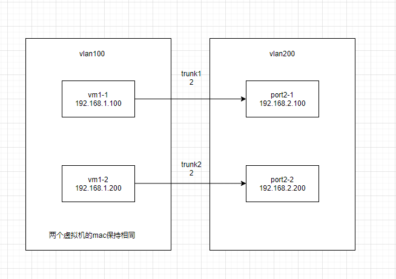
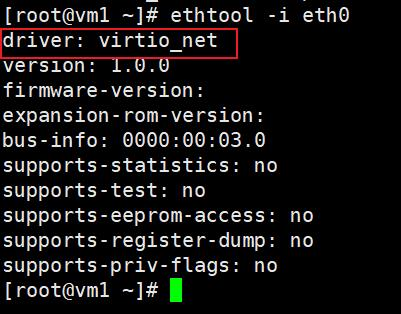

[toc]

## 1.Neutron

## 1.1 network

```bash
openstack network create --provider-network-type vlan --provider-physical-network < provider_name > --provider-segment <VLAN> net1
创建vlan透传
openstack network create --provider-network-type vlan --provider-physical-network default --provider-segment 100 --transparent-vlan Net1
创建非vlan透传
openstack network create --provider-network-type vlan --provider-physical-network default --provider-segment 200 --no-transparent-vlan Net2
```

## 1.2. subnet

```bash
openstack subnet create --network net1 --ip-version {4,6} --subnet-range <subnet address, eg: 10.0.0.0/24> --gateway <gateway> subnet1

```

## 1.3. port

```bash
创建指定ip的port
openstack port create --network <network> --fixed-ip subnet=<subnet>,ip-address=<ip-address> <port_name>
创建指定mac的port
openstack port create --vnic-type normal --network Net1 --mac-address <port1-1_mac> --fixed-ip subnet=Subnet1,ip-address=192.168.1.200 port1-2
创建normal或者sriov port
openstack port create --network Net1 --vnic-type normal/direct port1
```

## 1.3.1 router

```

openstack router create test
路由添加子网
openstack router add subnet test subnet1
路由设置网关
openstack router set --external-gateway ext-net test
删除网关
openstack router unset --external-gateway router_name
```

## 1.4. instance

```bash

openstack server create --image <image_id> --flavor <flavor_id> --nic port-id=<port_id> <server_name>
指定主机创建虚拟机
openstack server create VM1-1 --image Image1 --flavor Flavor1 --port <port1_id> --availability-zone AZ:compute1
虚拟机冷迁移
openstack server migrate VM1
openstack server resize --confirm VM1
虚拟机热迁移
openstack server migrate --live compute2 --wait VM1
```

## 1.5. qos

```bash
创建qos
openstack network qos policy create QoS1
设置qos（egress） --max-kbps：限速，--max-burst-kbits：突发带宽缓冲区
openstack network qos rule create --type bandwidth-limit --max-kbps 500000 --max-burst-kbits 100000 --egress QoS1
port设置qos
openstack port set --qos-policy QoS1 Port
修改qos
openstack network qos rule set --max-kbps 800000 --max-burst-kbits 150000 --ingress QoS1_rule_id
port取消qos
openstack port unset --qos-policy QoS1 Port1
network设置qos
openstack network set --qos-policy QoS2 Net1
```

## 1.6. ovs

```bash

查看网桥
ovs-vsctl show
查看port详情
ovs-vsctl list port port_id
查看qos
ovs-vsctl list qos
查看队列
ovs-vsctl list queue
查看ovs
ovs-vsctl list Open_vSwitch
设置other_config 设置老化时间
ovs-vsctl --no-wait -- set Open_vSwitch . other_config:max-idle=30000
移除other_config
ovs-vsctl --no-wait -- remove open . other_config dpdk-init
用于查看内核datapath以及相关的转发命中数
ovs-dpctl show
用处查看datapath中的流表 
ovs-dpctl dump-flows 
```

## 1.7. vlan透传

```bash
创建trunk，parent-port和port分别是两个虚拟机的port
openstack network trunk create --parent-port port1-1 --subport port=port2-1,segmentation-type=vlan,segmentation-id=2 trunk1
```



## 1.8. 网卡子接口

```bash
给eth0设置子接口
vconfig add eth0 2
```

## 1.9. 手动获取ip

```bash
dhclient	获取ip
dhclient -r	释放ip
```

## 1.10. 查看dhcp所在节点

```bash
neutron dhcp-agent-list-hosting-net sriov-net
添加dhcp_agent
neutron dhcp-agent-network-add DHCP_AGENT NETWORK
移除dhcp_agent
neutron dhcp-agent-network-remove DHCP_AGENT NETWORK
```

## 1.11. 查看组播地址

```bash
查看组播地址
ipmaddr show dev eth0
```

# 2. Nova

## 2.1 指定numa创建虚拟机

```bash
openstack server create --flavor m1.tiny --image image1 --nic net-id=<net1_id> --availability-zone az1:compute-1 --hint numa='[{"numa_id": 1}]'  vm1
```

## 2.2 查看虚拟机virtio



## 3. flavor

### 3.1 创建flavor

```bash
openstack flavor create 1c_2r_40g.1g --vcpus 1 --ram 2048 --disk 40 --property hw:mem_page_size='1GB'
```

# 4. Project

## 4.1 创建租户

# 5. Glance

## 5.1 上传镜像&设置网卡多队列

```
bash
openstack image create --container-format bare --disk-format raw --file /tmp/CentOS-7-x86_64-GenericCloud-7.9.2009-cmcc.qcow2 --property hw_vif_multiqueue_enabled="yes" --public centos79
```
