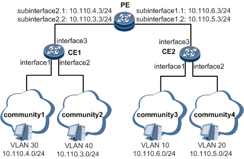
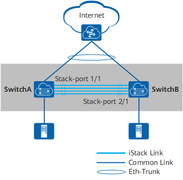
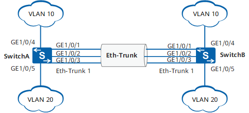

## 1. 查看交换机速率和双工模式

```bash
[~HUAWEI]display interface GE 1/0/1
GE1/0/1 current state : Administratively DOWN (ifindex: 3)
Line protocol current state : DOWN 
Description: 
Switch Port, PVID :    1, TPID : 8100(Hex), The Maximum Frame Length is 9216
Internet protocol processing : disabled
IP Sending Frames' Format is PKTFMT_ETHNT_2, Hardware address is 707b-e88b-2ec5
Last physical up time   : -
Last physical down time : 2022-10-13 16:36:17
Current system time: 2022-10-13 19:25:09
Statistics last cleared:never
    Last 300 seconds input rate: 0 bits/sec, 0 packets/sec
    Last 300 seconds output rate: 0 bits/sec, 0 packets/sec
    Input peak rate 0 bits/sec, Record time: -
    Output peak rate 0 bits/sec, Record time: -
    Input: 0 bytes, 0 packets   
    Output: 0 bytes, 0 packets
    Input: 
      Unicast: 0 packets, Multicast: 0 packets
      Broadcast: 0 packets, JumboOctets: 0 packets
      CRC: 0 packets, Symbol: 0 packets
      Overrun: 0 packets, InRangeLength: 0 packets
      LongPacket: 0 packets, Jabber: 0 packets, Alignment: 0 packets
      Fragment: 0 packets, Undersized Frame: 0 packets
      RxPause: 0 packets
    Output:
      Unicast: 0 packets, Multicast: 0 packets
      Broadcast: 0 packets, JumboOctets: 0 packets
      Lost: 0 packets, Overflow: 0 packets, Underrun: 0 packets
      System: 0 packets, Overruns: 0 packets
      TxPause: 0 packets
    Last 300 seconds input utility rate:  0.00%
    Last 300 seconds output utility rate: 0.00%
```

## 2. 设置交换机端口的双工模式和速率

```bash
[Huawei-GigabitEthernet0/0/1]undo negotiation auto
[Huawei-GigabitEthernet0/0/1]speed 10
[Huawei-GigabitEthernet0/0/1]duplex half
```

## 3. 查看mac表

```bash
[Huawei]dis mac-address
```

## 4. 查看mac老化时间

```bash
[Huawei]display mac-address aging-time 

  Aging time: 300 seconds
```

## 5. 关闭信息

```bash
The current change number is 5, th
e change loop count is 0, and the maximum number of records is 4095.

# 关闭信息中西
undo info-center enable
```

## 1. 交换机vlan子接口



配置思路

采用如下的思路配置VLAN间通过子接口通信：

1. 在CE上创建VLAN，确定用户所属的VLAN。
2. 在CE上配置允许用户所属的VLAN通过当前二层端口。
3. 在PE上创建子接口，并关联VLAN。
4. 在子接口上配置IP地址，实现网络层互通。

数据准备

为完成此配置例，需准备如下的数据：* 用户所属的VLAN ID。

* 用户的IP地址。
* CE连接用户的接口编号。
* PE与CE相连的接口编号。
* PE上子接口编号、IP地址。

### 1.1 操作步骤

配置CE1 CE2

```bash
<HUAWEI> system-view
[~HUAWEI] sysname CE1
[*HUAWEI] commit
[~CE1] vlan batch 30 40
[*CE1] interface gigabitethernet 1/0/1
[*CE1-GigabitEthernet1/0/1] portswitch
[*CE1-GigabitEthernet1/0/1] undo shutdown
[*CE1-GigabitEthernet1/0/1] port link-type access
[*CE1-GigabitEthernet1/0/1] port default vlan 30
[*CE1-GigabitEthernet1/0/1] quit
[*CE1] interface gigabitethernet 1/0/2
[*CE1-GigabitEthernet1/0/2] portswitch
[*CE1-GigabitEthernet1/0/2] undo shutdown
[*CE1-GigabitEthernet1/0/2] port link-type access
[*CE1-GigabitEthernet1/0/2] port default vlan 40
[*CE1-GigabitEthernet1/0/2] quit

<HUAWEI> system-view
[~HUAWEI] sysname CE2
[*HUAWEI] commit
[~CE2] vlan batch 10 20
[*CE2] interface gigabitethernet 1/0/1
[*CE2-GigabitEthernet1/0/1] portswitch
[*CE2-GigabitEthernet1/0/1] undo shutdown
[*CE2-GigabitEthernet1/0/1] port link-type access
[*CE2-GigabitEthernet1/0/1] port default vlan 10
[*CE2-GigabitEthernet1/0/1] quit
[*CE2] interface gigabitethernet 1/0/2
[*CE2-GigabitEthernet1/0/2] portswitch
[*CE2-GigabitEthernet1/0/2] undo shutdown
[*CE2-GigabitEthernet1/0/2] port link-type access
[*CE2-GigabitEthernet1/0/2] port default vlan 20
[*CE2-GigabitEthernet1/0/2] quit
```

分别在CE1、CE2上配置允许用户所属的VLAN通过当前二层端口

```bash
[*CE1] interface gigabitethernet 1/0/3
[*CE1-GigabitEthernet1/0/3] portswitch
[*CE1-GigabitEthernet1/0/3] undo shutdown
[*CE1-GigabitEthernet1/0/3] port link-type trunk
[*CE1-GigabitEthernet1/0/3] port trunk allow-pass vlan 30 40
[*CE1-GigabitEthernet1/0/3] quit
[*CE1] commit

[*CE2] interface gigabitethernet 1/0/3
[*CE2-GigabitEthernet1/0/3] portswitch
[*CE2-GigabitEthernet1/0/3] undo shutdown
[*CE2-GigabitEthernet1/0/3] port link-type trunk
[*CE2-GigabitEthernet1/0/3] port trunk allow-pass vlan 10 20
[*CE2-GigabitEthernet1/0/3] quit
[*CE2] commit
```

在PE上创建子接口并关联VLAN

```bash
<HUAWEI> system-view
[~HUAWEI] sysname PE
[*HUAWEI] commit
[~PE] interface gigabitethernet 1/0/1
[*PE-GigabitEthernet1/0/1] undo shutdown
[*PE-GigabitEthernet1/0/1] quit
[*PE] interface gigabitethernet 1/0/1.1
[*PE-GigabitEthernet1/0/1.1] vlan-type dot1q 10
[*PE-GigabitEthernet1/0/1.1] quit
[*PE] interface gigabitethernet 1/0/1.2
[*PE-GigabitEthernet1/0/1.2] vlan-type dot1q 20
[*PE-GigabitEthernet1/0/1.2] quit
[*PE] interface gigabitethernet 1/0/2
[*PE-GigabitEthernet1/0/2] undo shutdown
[*PE-GigabitEthernet1/0/2] quit
[*PE] interface gigabitethernet 1/0/2.1
[*PE-GigabitEthernet1/0/2.1] vlan-type dot1q 30
[*PE-GigabitEthernet1/0/2.1] quit
[*PE] interface gigabitethernet 1/0/2.2
[*PE-GigabitEthernet1/0/2.2] vlan-type dot1q 40
[*PE-GigabitEthernet1/0/2.2] quit
```

配置IP地址

```bash
[*PE] interface gigabitethernet 1/0/1.1
[*PE-GigabitEthernet1/0/1.1] ip address 10.110.6.3 24
[*PE-GigabitEthernet1/0/1.1] quit
[*PE] interface gigabitethernet 1/0/1.2
[*PE-GigabitEthernet1/0/1.2] ip address 10.110.5.3 24
[*PE-GigabitEthernet1/0/1.2] quit
[*PE] interface gigabitethernet 1/0/2.1
[*PE-GigabitEthernet1/0/2.1] ip address 10.110.4.3 24
[*PE-GigabitEthernet1/0/2.1] quit
[*PE] interface gigabitethernet 1/0/2.2
[*PE-GigabitEthernet1/0/2.2] ip address 10.110.3.3 24
[*PE-GigabitEthernet1/0/2.2] quit
[*PE] commit
```

检查配置结果

在VLAN10中的主机上配置缺省网关为GE1/0/1.1接口的IP地址10.110.6.3/24。

在VLAN20中的主机上配置缺省网关为GE1/0/1.2接口的IP地址10.110.5.3/24。

在VLAN30中的主机上配置缺省网关为GE1/0/2.1接口的IP地址10.110.4.3/24。

在VLAN40中的主机上配置缺省网关为G1/0/2.2接口的IP地址10.110.3.3/24。

配置完成后，VLAN10、20、30及40之间的主机能够相互Ping通。

https://support.huawei.com/enterprise/zh/doc/EDOC1100055080/6368872f

## 1.2 单臂路由（路由子接口）

```bash
创建并进入子接口
interface g0/0/0.10
配置802.1q协议并配置pvid
dot1q termination vid 10
设置网关
ip address 10.0.10.254 24
启用arp
arp broadcast enable
quit
```

## 2. 堆叠

ensp不能模拟堆叠

通过组建堆叠，可以实现网络大规模数据转发和高可靠性。

采用堆叠方案，后续升级过程中，业务中断时间可能较长。对于升级中断时间敏感的业务，请使用M-LAG方案。

堆叠iStack（Intelligent Stack）是指将多台交换机通过堆叠线缆连接在一起，从逻辑上变成一台交换设备，作为一个整体参与数据转发



## 2.1 配置思路

```bash
配置思路
采用如下的思路配置：
提前规划好堆叠方案。

按照前期的规划，完成各台交换机的堆叠配置，包括堆叠成员ID、堆叠优先级、堆叠域编号、堆叠端口等。完成后保存配置并将交换机下电。

连接交换机之间的堆叠线缆，然后将交换机上电。

检查堆叠组建是否成功。
```

## 2.2 操作步骤

### 2.2.1 提前规划堆叠方案

```bash
规划SwitchA的堆叠成员ID为1，SwitchB的成员ID为2。
规划SwitchA作为主交换机，其堆叠优先级最高，为150。SwitchB的堆叠优先级为120。
规划堆叠域编号（Domain ID）为10，不与网络中其他堆叠系统的域编号冲突。
规划SwitchA和SwitchB用于堆叠连接的端口为10GE1/0/1～10GE1/0/4。
```

### 2.2.2 配置堆叠属性

配置SwitchA的堆叠优先级为150，Domain ID为10。缺省情况下，设备的堆叠成员ID为1。此处默认SwitchA的堆叠成员ID为1，无需配置。

```bash
<HUAWEI> system-view
[~HUAWEI] sysname SwitchA
[*HUAWEI] commit
[~SwitchA] stack
[~SwitchA-stack] stack member 1 priority 150
Info: The operation will take effect after reboot. 
[*SwitchA-stack] stack member 1 domain 10
Info: The operation takes effect only after the save command is executed. The device with a lower priority then will be reset in the stack merging scenario.
[*SwitchA-stack] quit
[*SwitchA] commit
```

配置SwitchB的堆叠成员ID为2，优先级为120，Domain ID为10。

```bash
<HUAWEI> system-view
[~HUAWEI] sysname SwitchB
[*HUAWEI] commit
[~SwitchB] stack
[~SwitchB-stack] stack member 1 priority 120
Info: The operation will take effect after reboot. 
[*SwitchB-stack] stack member 1 domain 10
Info: The operation takes effect only after the save command is executed. The device with a lower priority then will be reset in the stack merging scenario.
[*SwitchB-stack] stack member 1 renumber 2 inherit-config
Warning: The stack configuration of member ID 1 will be inherited to member ID 2 after the device resets. Continue? [Y/N]: y
[*SwitchB-stack] quit
[*SwitchB] commit
```

由于SwitchB尚未重启，当前堆叠成员ID为1，此时需要使用**member 1**来进行堆叠配置。

Switch B使用**stack member 1 renumber 2 inherit-config**命令修改堆叠成员ID时，需要指定**inherit-config**参数。如果不指定**inherit-config**参数，**member 2**不会继承**member 1**的堆叠配置，需要使用**member 2**重新进行堆叠配置。指定**inherit-config**参数后，**member 2**可直接继承**member 1**的堆叠配置。

配置堆叠端口。

将SwitchA的业务口10GE1/0/1～10GE1/0/4加入堆叠端口1/1。

```bash
[~SwitchA] interface stack-port 1/1
[*SwitchA-Stack-Port1/1] port member-group interface 10ge 1/0/1 to 1/0/4
Warning: After the configuration is complete,
1.The interface(s) (10GE1/0/1-1/0/4) will be converted to stack mode and be configured with the port crc-statistics trigger error-down command if the configuration does not exist. 
2.The interface(s) may go Error-Down (crc-statistics) because there is no shutdown configuration on the interfaces.Continue? [Y/N]: y
[*SwitchA-Stack-Port1/1] commit
[~SwitchA-Stack-Port1/1] return
```

被配置为堆叠物理成员端口后，端口下会自动配置 **port crc-statistics trigger error-down** 。

将SwitchB的业务口10GE1/0/1～10GE1/0/4加入堆叠端口1/1。

```bash
[~SwitchB] interface stack-port 1/1
[*SwitchB-Stack-Port1/1] port member-group interface 10ge 1/0/1 to 1/0/4
Warning: After the configuration is complete,
1.The interface(s) (10GE1/0/1-1/0/4) will be converted to stack mode and be configured with the port crc-statistics trigger error-down command if the configuration does not exist. 
2.The interface(s) may go Error-Down (crc-statistics) because there is no shutdown configuration on the interfaces.Continue? [Y/N]: y
[*SwitchB-Stack-Port1/1] commit
[~SwitchB-Stack-Port1/1] return
```

### 2.2.3 检查堆叠信息

```bash
<SwitchA> display stack configuration
Oper          : Operation
Conf          : Configuration
*             : Offline configuration
Isolated Port : The port is in stack mode, but does not belong to any Stack-Port

Attribute Configuration:
----------------------------------------------------------------------------
 MemberID      Domain         Priority       Switch Mode     Uplink Port
Oper(Conf)   Oper(Conf)      Oper(Conf)      Oper(Conf)      Oper(Conf)
----------------------------------------------------------------------------
1(1)         --(10)          100(150)        Auto(Auto)      4*40GE(4*40GE)
----------------------------------------------------------------------------
Stack-Port Configuration:
--------------------------------------------------------------------------------
Stack-Port      Member Ports
--------------------------------------------------------------------------------
Stack-Port1/1   10GE1/0/1           10GE1/0/2           10GE1/0/3
                10GE1/0/4
--------------------------------------------------------------------------------
```

## 2.2.4 保存配置后将设备下电

保存SwitchA和SwitchB的配置，然后将设备下电。

```bash
<SwitchA> save
Warning: The current configuration will be written to the device. Continue? [Y/N]: y
```

### 2.2.5 按照前期规划及配置，连接堆叠线缆。线缆连接完成后将设备上电

建议先将高优先级设备上电，以使其先完成启动，优先竞争为主交换机。

### 2.2.6 验证配置结果

```bash
<SwitchA> display stack
--------------------------------------------------------------------------------
MemberID Role     MAC              Priority   DeviceType         Description
--------------------------------------------------------------------------------
 1       Master   0004-9f31-d520   150        CE6850-48T4Q-EI 
 2       Standby  0004-9f62-1f40   120        CE6850-48T4Q-EI 
--------------------------------------------------------------------------------
```

如上所示，显示两台交换机的信息，表示堆叠建立成功，且主交换机为成员ID为1的设备，即SwitchA。

查看堆叠系统拓扑信息

```bash
<SwitchA> display stack topology
Stack Topology:
----------------------------------------------
            Stack-Port 1      Stack-Port 2
MemberID   Status Neighbor   Status Neighbor
----------------------------------------------
1          up     2          --     --
2          up     1          --     --
----------------------------------------------

Stack Link:
----------------------------------------------------------------------------
Stack-Port       Port               Status     PeerPort           PeerStatus
----------------------------------------------------------------------------
Stack-Port1/1    10GE1/0/1          up         10GE2/0/1          up
Stack-Port1/1    10GE1/0/2          up         10GE2/0/2          up
Stack-Port1/1    10GE1/0/3          up         10GE2/0/3          up
Stack-Port1/1    10GE1/0/4          up         10GE2/0/4          up
Stack-Port2/1    10GE2/0/1          up         10GE1/0/1          up
Stack-Port2/1    10GE2/0/2          up         10GE1/0/2          up
Stack-Port2/1    10GE2/0/3          up         10GE1/0/3          up
Stack-Port2/1    10GE2/0/4          up         10GE1/0/4          up
----------------------------------------------------------------------------
```

### 2.2.7 保存堆叠系统配置

```bash
<SwitchA> save
Warning: The current configuration will be written to the device. Continue? [Y/N]: y
```

### 2.2.8 配置文件

堆叠系统的配置文件

```bash
#
sysname SwitchA
#
stack
 #
 stack member 1 domain 10
 stack member 1 priority 150
 #
 stack member 2 domain 10
 stack member 2 priority 120
#
interface Stack-Port1/1
#
interface Stack-Port2/1
#
interface 10GE1/0/1
 port mode stack
 stack-port 1/1
 port crc-statistics trigger error-down
#
interface 10GE1/0/2
 port mode stack
 stack-port 1/1
 port crc-statistics trigger error-down
#
interface 10GE1/0/3
 port mode stack
 stack-port 1/1
 port crc-statistics trigger error-down
#
interface 10GE1/0/4
 port mode stack
 stack-port 1/1
 port crc-statistics trigger error-down
#
interface 10GE2/0/1
 port mode stack
 stack-port 2/1
 port crc-statistics trigger error-down
#
interface 10GE2/0/2
 port mode stack
 stack-port 2/1
 port crc-statistics trigger error-down
#
interface 10GE2/0/3
 port mode stack
 stack-port 2/1
 port crc-statistics trigger error-down
#
interface 10GE2/0/4
 port mode stack
 stack-port 2/1
 port crc-statistics trigger error-down
#
return
```

https://support.huawei.com/enterprise/zh/doc/EDOC1100143453

## 3. 手动链路聚合

以太网链路聚合是指将多条以太网物理链路捆绑在一起成为一条逻辑链路，从而实现增加链路带宽的目的。链路聚合分为手工模式和LACP模式。

手工模式下，Eth-Trunk的建立、成员接口的加入由手工配置，没有链路聚合控制协议LACP的参与。当需要在两个直连设备间提供一个较大的链路带宽而设备又不支持LACP协议时，可以使用手工模式。手工模式可以实现增加带宽、提高可靠性、负载分担的目的。

手工模式下，所有的活动链路都参与数据转发并分担流量。

### 3.1 配置注意事项

* 一个Eth-Trunk接口中的成员接口必须是以太网类型和速率相同的接口。
* Eth-Trunk链路两端相连的物理接口的数量、速率、双工方式、流控配置必须一致。
* 如果本端设备接口加入了Eth-Trunk，与该接口直连的对端接口也必须加入Eth-Trunk，两端才能正常通信。
* 两台设备对接时需要保证两端设备上链路聚合的模式一致。

### 3.2 组网需求

**Switch**A和**Switch**B通过以太链路分别都连接VLAN10和VLAN20的网络，且**Switch**A和**Switch**B之间有较大的数据流量。

用户希望**Switch**A和**Switch**B之间能够提供较大的链路带宽来使相同VLAN间互相通信。同时用户也希望能够提供一定的冗余度，保证数据传输和链路的可靠性。



### 3.3 配置思路

采用如下的思路配置手工模式链路聚合：

1. 创建Eth-Trunk接口并加入成员接口，实现增加链路带宽。
2. 创建VLAN并将接口加入VLAN。
3. 配置负载分担方式，实现流量在Eth-Trunk各成员接口间的负载分担，增加可靠性。

### 3.4 操作步骤

### 3.4.1在SwitchA和SwitchB上创建Eth-Trunk接口并加入成员接口

```bash
<HUAWEI> system-view
[HUAWEI] sysname SwitchA
[SwitchA] interface eth-trunk 1   //创建ID为1的Eth-Trunk接口
[SwitchA-Eth-Trunk1] trunkport gigabitethernet 1/0/1 to 1/0/3   //在Eth-Trunk1接口中加入GE1/0/1到GE1/0/3三个成员接口
[SwitchA-Eth-Trunk1] quit

<HUAWEI> system-view
[HUAWEI] sysname SwitchB
[SwitchB] interface eth-trunk 1   //创建ID为1的Eth-Trunk接口
[SwitchB-Eth-Trunk1] trunkport gigabitethernet 1/0/1 to 1/0/3   //在Eth-Trunk1接口中加入GE1/0/1到GE1/0/3三个成员接口
[SwitchB-Eth-Trunk1] quit
```

### 3.4.2 创建VLAN并将接口加入VLAN

创建VLAN10和VLAN20并分别加入接口。SwitchB的配置与SwitchA类似

```bash
[SwitchA] vlan batch 10 20
[SwitchA] interface gigabitethernet 1/0/4
[SwitchA-GigabitEthernet1/0/4] port link-type trunk   //设置接口链路类型为trunk，接口缺省链路类型不是trunk口
[SwitchA-GigabitEthernet1/0/4] port trunk allow-pass vlan 10
[SwitchA-GigabitEthernet1/0/4] quit
[SwitchA] interface gigabitethernet 1/0/5
[SwitchA-GigabitEthernet1/0/5] port link-type trunk   //设置接口链路类型为trunk，接口缺省链路类型不是trunk口
[SwitchA-GigabitEthernet1/0/5] port trunk allow-pass vlan 20
[SwitchA-GigabitEthernet1/0/5] quit
```

配置Eth-Trunk1接口允许VLAN10和VLAN20通过。SwitchB的配置与SwitchA类似，不再赘述。

```bash
[SwitchA] interface eth-trunk 1
[SwitchA-Eth-Trunk1] port link-type trunk   //设置接口链路类型为trunk，接口缺省链路类型不是trunk口
[SwitchA-Eth-Trunk1] port trunk allow-pass vlan 10 20
[SwitchA-Eth-Trunk1] quit
```

配置Eth-Trunk1的负载分担方式。SwitchB的配置与SwitchA类似，不再赘述。

```bash
[SwitchA] interface eth-trunk 1
[SwitchA-Eth-Trunk1] load-balance src-dst-mac   //配置Eth-Trunk1基于源MAC地址与目的MAC地址进行负载分担
[SwitchA-Eth-Trunk1] quit
```

验证配置结果

```bash
[SwitchA] display eth-trunk 1
Eth-Trunk1's state information is: 
WorkingMode: NORMAL           Hash arithmetic: According to SA-XOR-DA
Least Active-linknumber: 1     Max Bandwidth-affected-linknumber: 8
Operate status: up             Number Of Up Port In Trunk: 3 
--------------------------------------------------------------------------------
PortName                           Status       Weight
GigabitEthernet1/0/1               Up           1
GigabitEthernet1/0/2               Up           1
GigabitEthernet1/0/3               Up           1
```

参考：https://support.huawei.com/enterprise/zh/doc/EDOC1000069491/5d18b4c0

## 5. lacp聚合

https://info.support.huawei.com/info-finder/encyclopedia/zh/LACP.html

## 6. vlanif

https://support.huawei.com/enterprise/zh/doc/EDOC1000069491/b699322c#ZH-CN_TASK_0177091266

```bash
创建vlan 10 和20
vlan batch 10 20
创建并进入vlanif 10
interface vlanif 10
配置网关
ip address 10.0.0.1 24
quit

```

## 7. portswitch

```
portswitch命令用来配置将以太网接口从三层模式切换到二层模式。

undo portswitch命令用来配置将以太网接口从二层模式切换到三层模式。
```

## 8. 中兴交换机

```bash
switchvlan-configuration
switchport mode trunk
switchport trunk vlan 2-40,100-110,1000-1010,1801
switchport trunk native vlan 1801

一台新的设备用户名是admin 密码是zhongxing enable密码是zxr10

查看配置：
show mac table | include 7510
show running-config

进入vlan：
switchvlan 
int smartgroup1
show this

配置vlan：
switchport mode trunk
switchport trunk vlan 2-40

保存：
write 


```

## 9. 浪潮交换机

```
显示mac表
show mac-filter address-table


```

## 10. vlan子接口

```
https://access.redhat.com/documentation/en-us/red_hat_enterprise_linux/6/html/deployment_guide/s2-networkscripts-interfaces_network-bridge
https://www.cnblogs.com/kaishirenshi/p/10245228.html
https://blog.csdn.net/qq_20817327/article/details/106996447
https://blog.csdn.net/qq_20817327/category_10796566.html

```
