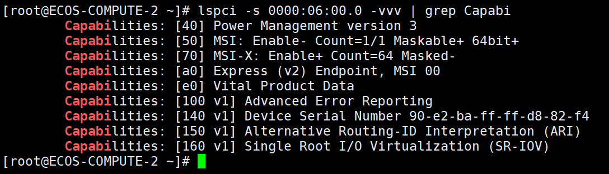

- [1. TCPDUMP](#1-tcpdump)
- [1.只抓每个包的前80字节](#1只抓每个包的前80字节)
- [2.只抓与某ip相关的包](#2只抓与某ip相关的包)
- [3.抓包除了要小，最好能为每步打上标记](#3抓包除了要小最好能为每步打上标记)
- [4.协议依赖性过滤方法](#4协议依赖性过滤方法)
- [5. 过滤方法](#5-过滤方法)
- [6. 过滤延迟200ms的包](#6-过滤延迟200ms的包)
- [7. 设置seq和ack为相对值](#7-设置seq和ack为相对值)
- [8. 三次握手](#8-三次握手)
- [9. 过滤被拒绝或丢包](#9-过滤被拒绝或丢包)
- [10. 过滤重传](#10-过滤重传)
- [11. 设置语言](#11-设置语言)
- [12. 输出综合多种错误](#12-输出综合多种错误)
- [13.  启动网卡和查看连线](#13--启动网卡和查看连线)
- [14. 网卡组bond配置](#14-网卡组bond配置)
- [15. 查看bond](#15-查看bond)
- [16. 包计算](#16-包计算)
- [17. 查看pci号](#17-查看pci号)
- [18. 查看是否支持sriov](#18-查看是否支持sriov)

## 1. TCPDUMP


## 1.只抓每个包的前80字节

```bash
tcpdump -i eth0 -s 80 -w /tmp/tcpdump.cap
```

默认只抓取前96个字节

## 2.只抓与某ip相关的包

```bash
tcpdump -i eth0 host 10.10.10.10 -w /tmp/tcpdump.cap
```

## 3.抓包除了要小，最好能为每步打上标记

-l:设置在送出要求信息之前，先行发出的数据包

```bash
a) ping ip -n 1 -l 1
b)操作步骤1
c) ping ip -n 1 -l 2
d)操作步骤2
e) ping ip -n 1 -l 3
f) 操作步骤3
```

## 4.协议依赖性过滤方法

```bash
portmap || mount
```

## 5. 过滤方法

```bash
ip.addr eq 10.10.10.10 && tcp.port eq 445
```

## 6. 过滤延迟200ms的包

```
tcp.analysis.ack_rtt > 0.2 and tcp.len ==0
```

延迟确认的作用是：少一些确认包可以节省带宽

## 7. 设置seq和ack为相对值

Edit-Preferences-Protocols-Tcp


## 8. 三次握手


## 9. 过滤被拒绝或丢包

```
(tcp.flags.reset == 1) && (tcp.seq == 1)
```

## 10. 过滤重传

```
(tcp.flags.syn == 1) && (tcp.analysis.retransmission)
```

重传原因：
1、对方没收到
2、对方回复的确认包丢失了

## 11. 设置语言

首选项里


## 12. 输出综合多种错误


## 13.  启动网卡和查看连线


## 14. 网卡组bond配置

常用的有三种
mode=0：平衡负载模式，有自动备援，但需要”Switch”支援及设定。
mode=1：自动备援模式，其中一条线若断线，其他线路将会自动备援。
mode=6：平衡负载模式，有自动备援，不必”Switch”支援及设定。

```
模式1：bond0接口只配置一个vlan 302段的IP
1.配置/etc/modprobe.d/bond.conf
alias bond0 bonding
options bond0 miimon=100 mode=1
2.创建ifcfg-bond0文件
DEVICE=bond0
TYPE=Ethernet
ONBOOT=yes
BOOTPROTO=none
3.创建子接口
DEVICE=bond0.302
TYPE=Vlan
ONBOOT=yes
BOOTPROTO=none
IPADDR=192.168.0.2
NETMASK=255.255.255.0
VLAN=yes
VLAN_ID=xxx
4.修改网卡文件
DEVICE=eno1
TYPE=Ethernet
ONBOOT=yes
BOOTPROTO=none
MASTER=bond0
SLAVE=yes
5.重启网络
systemctl restart network.service

https://blog.csdn.net/weixin_33965305/article/details/92917986
```

## 15. 查看bond

```
/proc/net/bonding/bondxxx
```


## 16. 包计算

后一个包的seq=前一个包的seq+len

## 17. 查看pci号

```bash
ethtool -i ens4f0
```


## 18. 查看是否支持sriov



```bash
lspci -s 0000:06:00.0 -vvv | grep Capabi
```
